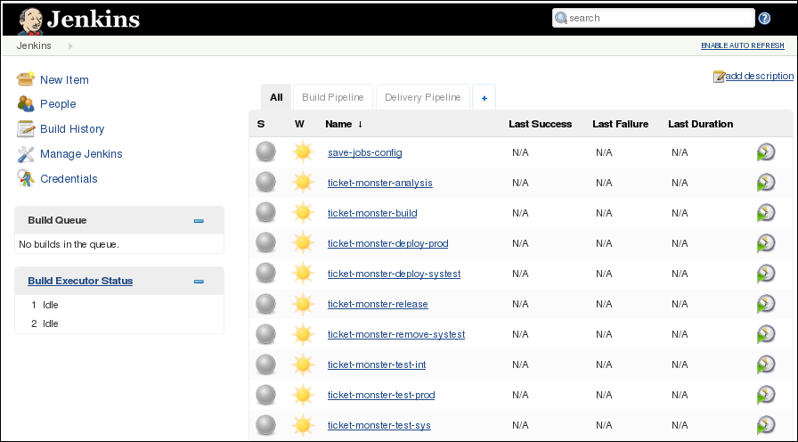
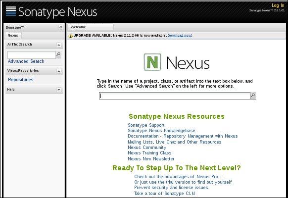

= *continuous-delivery-javaee-container-src*

:data-uri:
:toc: manual
:toc-placement: preamble
:numbered:
:webinar: link:http://blog.eisele.net/2015/04/continuous-delivery-with-docker.html[Continuous Delivery with Docker Containers & Java EE webinar]
:dcompose: link:https://docs.docker.com/compose/[Docker Compose]
:ticketmonster: link:http://www.jboss.org/ticket-monster/[Ticket Monster]
:supportportal: link:https://access.redhat.com/support[Red Hat Support Portal]

This repository contains the source code and step-by-step instructions needed to reproduce the {webinar}.

== Overview

=== *Goals*
=== *Ticket Monster* JEE project

The {ticketmonster} JEE project is a moderately complex application that demonstrates how to build modern applications using JBoss web technologies.

=== Deployment Diagram

== Pre-requisites

. *Network Bandwidth*
+
During this lab exercise, Docker images will be pulled from the internet.
You'll want a high-speed broadband connection and open access to the internet.
. *Hardware*
+
To execute this lab exercise, three machines will be needed.
Each machine should consist of a minimum of 2 cores and 4G RAM.
The machines can run locally or as VMs in a cloud environment.
. *Red Hat Network Subscription*
+
You must have a valid _Red Hat Network (RHN) subscription with entitlements that allow for:

.. management of _rhel-server-7_ operating systems
.. download of supported Red Hat JBoss middleware software.
. *Operating System*
+
Currently, the host operating system required to build the docker images provided in this project needs to be Red Hat Enterprise Linux (RHEL) 7.
The RHEL7 hosts should be registered with the Red Hat Network (RHN) via _subscription-manager_.
+
In the near future, Red Hat will be providing a _RHEL CDK_ (Container Development Kit).
The RHEL CDK will allow for building of images in this project on host operating systems such as Fedora, OSX and Windows.
. *git*
+
Ensure that `git` is installed on the host operating system.
. *Docker*
+
Ensure that `docker` is installed and running on the host operating system.
. *{dcompose}*

[[baseimages]]
== *baseimages*

=== Clone this project

----
git clone https://github.com/jbossdemocentral/continuous-delivery-javaee-container-src.git
----

Doing so creates a directory on your local workstation called:  _continuous-delivery-javaee-container-src_.

[NOTE]
For the purpose of the instructions in this exercise, the directory created from having cloned this project will be referred to as: *$PROJECT_HOME*.

=== Build *baseimages*
Docker images from this project need to be built prior to the creation of docker containers that support our `dev-env`, `systest` and `prod` environments.

Docker-compose is used to build the Docker images included in this project.

Docker-compose is a convenient tool however one limitation is that it’s not smart enough to build images in the order specified in the project's docker-compose yaml config.
Instead, docker-compose attempts to build images in alphabetic order.

This limitation can be overcome by explicitly specifying the order in which to build the project's images.

. cd $PROJECT_HOME/demo
. add *jboss-eap-6.4*
.. Use your _RHN_ userId to access the {supportportal}.
.. Download *jboss-eap-6.4.0.zip*
.. Copy *jboss-eap-6.4.0.zip* to the following directory on the host machine:  `$PROJECT_HOME/demo/images/appserverbase/resources`
. Generate ssh key pair
+
SSH keys are used to create ssh and scp connections between the `demo_jenkins_1` container and the host operating systems where the `systest` and `prod` containers are running.
These connections are used to automatically push JEE artifacts from `demo_jenkins_1` to those other environments.
+
In this step, an ssh key pair will be created.
This ssh key pair will be automatically added to the `demo_jenkins_1` container when built.
Later in this exercise, the public key of this key pair will be copied to the host operating systems where the `systest` and `prod` containers are running.

.. cd $PROJECT_HOME/demo
.. execute: `ssh-keygen -q -f images/jenkins-ci/config/.ssh/id_rsa -t rsa -N ''`
+
The key pair will be created (with no passphrase) in the directory: `images/jenkins-ci/config/.ssh`
. docker-compose -f baseimages.yml build base
+
Build the project's _base_ image first.
+
[NOTE]
Depending on network bandwidth, expect this step to take a few minutes while the RHEL7 base docker image is downloaded and updated.
. docker-compose -f baseimages.yml build
+
Build all other images specified in the project's `baseimages.yml` config file.
+
[NOTE]
Expect this step to take longer than the previous.
Several products (such as Jenkins) are downloaded.
. Execute: `docker images`
+
This command should provide a listing of all of the images that have been built thus far.
The output should appear similar to the following:
+
image::doc/images/baseimages.png[]

== *dev-env* environment

=== Review *dev-env* Images
==== *Sonar*
==== *Nexus*
==== *Jenkins*

=== Start *dev-env* containers

. cd $PROJECT_HOME/demo
. docker-compose -f dev-env.yml up -d
+
[NOTE]
Depending on network bandwidth, expect this step to take a while as well as the _Sonar_ and _Nexus_ images are downloaded.
. docker-compose -f dev.yml up -d
+
This step starts a container that includes the `Ticket Monster` application.

. docker ps -a
+
Make note of the newly instantiated docker containers and their port mappings.

Your *dev-env* machine should now have the following running Docker containers:

.. *demo_jenkins_1*
+
Accessible via your browser at the following URL:
+
-----
http://<address_of_dev_machine>:9080/jenkins
-----
+

.. *demo_nexus_1*
+
Accessible via your browser at the following URL:
+
-----
http://<address_of_dev_machine>:8081/nexus
-----
+

.. *demo_sonar_1*
+
Accessible via your browser at the following URL:
+
-----
http://<address_of_dev_machine>:9000
-----
+
image::doc/images/sonar.png[]

== *systest* environment

=== Review *systest* Images

=== Start *systest* containers

. cd $PROJECT_HOME/demo
. docker-compose -f systest.yml up -d
. docker ps -a
+
Your *systest* machine should now have one running Docker container: *demo_systest_1*
+
This container is accessible via your browser at the following interfaces:

.. *JBoss EAP Management Console*
+
-----
http://<address_of_systest_machine>:19990
-----
+
Authenticate using a userId/password of:  `admin / admin-123`
+
image::doc/images/eapmgmt.png[]
.. *Ticket Monster Homepage*
+
-----
http://<address_of_systest_machine>:18080/ticket-monster
-----
+
image::doc/images/tmonsterhome.png[]

== *prod* environemnt

== Ticket Monster Delivery Pipeline

=== Overview

=== Start *ticket-monster-build*

=== Real-World Considerations

==== *ticket-monster-build* initiation
==== Email set-up
==== Human Task: systest -> prod

== Conclusion
