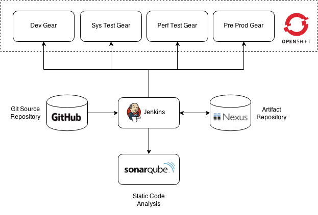
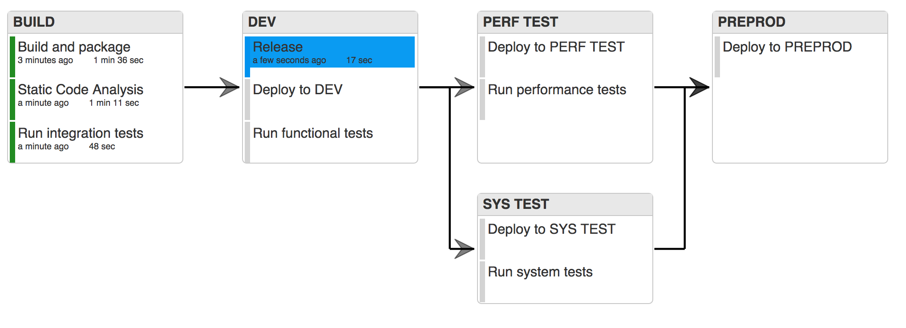
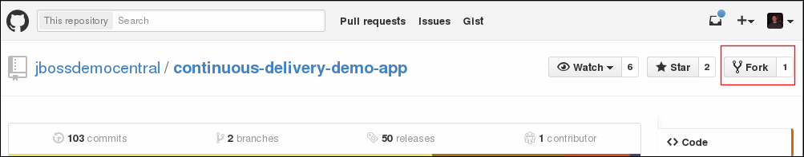
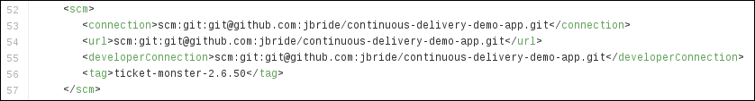
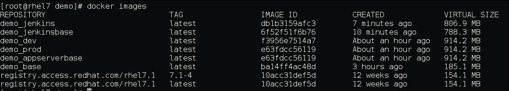
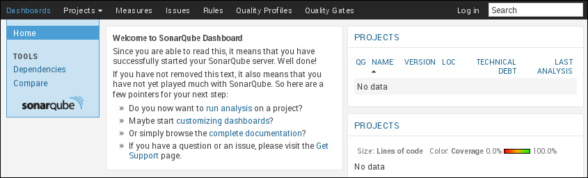
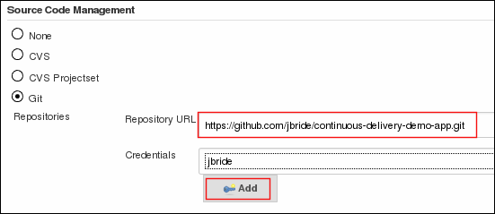
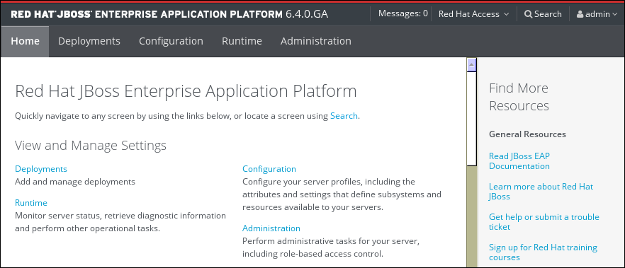
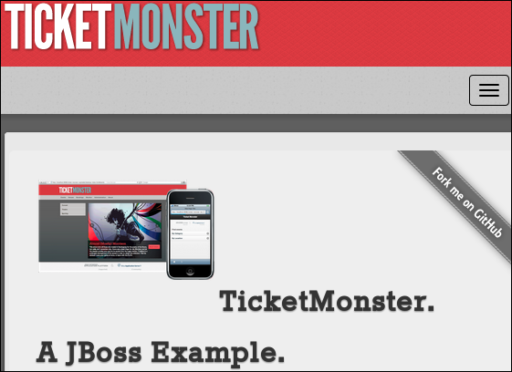

= *Continuous Delivery with Docker Containers & Java EE*

:data-uri:
:toc: manual
:toc-placement: preamble
:numbered:
:webinar: link:http://blog.eisele.net/2015/04/continuous-delivery-with-docker.html[Continuous Delivery with Docker Containers & Java EE webinar]
:dcompose: link:https://docs.docker.com/compose/[Docker Compose]
:ticketmonster: link:http://www.jboss.org/ticket-monster/[Ticket Monster]
:supportportal: link:https://access.redhat.com/support[Red Hat Support Portal]
:jbossdemocentral: link:https://www.gitub.com/jbossdemocentral/continuos-delivery-demo-app[jbossdemocentral]
:markusblog: link:http://blog.eisele.net/2015/04/continuous-delivery-with-docker.html[Markus' Blog]
:paas: link:https://www.openshift.com[paas]

This repository contains the source code and step-by-step instructions needed to reproduce the {webinar}.

== Overview

=== *Goals*
This demo sets up a complete Continuous Delivery environment using Docker containers.

This demo uses {dcompose} as a simple orchestration tool.
Docker is used for simplicity in this demo and is not essential to the delivery pipeline.

More details discused in {markusblog}.

=== Infrastructure
This demo uses various components to create a delivery pipeline.
Jenkins, Nexus and Sonar run in their own Docker containers while GitHub is used as an external Git-based source repository.

. *Jenkins*
+
Description: continuous delivery orchestration engine
+
Address: http://DOCKER_HOST:8080/jenkins

. *Sonatype Nexus*
+
Description: artifact repository for archiving release binaries
+
Address: http://DOCKER_HOST:8081/nexus

. *SonarQube*
+
Description: static code analysis engine extracting various quality metrics from the code
+
Address: http://DOCKER_HOST:9000

. *GitHub*
+
Description: source repository hosting the ticket-monster Java application
+
Address: https://github.com/jbossdemocentral/continuous-delivery-demo-app.git

[NOTE]

If running boot2docker on Mac OSX, DOCKER_HOST is the ip of boot2docker virtual machine

=== Delivery Pipeline
The delivery pipeline in this demo is divided into five phases each containing a number of activities (jobs) that need to succeed in order to promote the artifact to the next phase.
Each change in the application is a potential production release according to Continuous Delivery principles and can go in production if it successfully passes through all the phases in the pipeline.

. Build: compilation and unit test, integration tests and static code analysis
. Dev: release to Nexus, create release tag in Git, deploy to DEV server and run functional tests
. System Test: deploy to System Test server and run system tests
. Perf Test: deploy to Performance Test server and run performance tests
. Pre Production (Stage): deploy to Pre-Production server

=== *Ticket Monster* JEE project
Continuous Delivery from dev -> prod in a Docker environment will be demonstrated in this exercise using the {ticketmonster} JEE application.

The {ticketmonster} JEE project is a moderately complex application that demonstrates how to build modern applications using JBoss web technologies.

== Pre-requisites

. *Network Bandwidth*
+
During this lab exercise, Docker images will be pulled from the internet.
You'll want a high-speed broadband connection and open access to the internet.
. *Hardware*
+
To execute this lab exercise, three machines will be needed.
Each machine should consist of a minimum of 2 cores and 4G RAM.
The machines can run locally or as VMs in a cloud environment.
. *Red Hat Network Subscription*
+
You must have a valid _Red Hat Network (RHN) subscription with entitlements that allow for:

.. management of _rhel-server-7_ operating systems.
.. download of supported Red Hat JBoss middleware software.
. *Operating System*
+
Currently, the host operating system required to build the docker images provided in this project needs to be Red Hat Enterprise Linux (RHEL) 7.
The RHEL7 hosts should be registered with the Red Hat Network (RHN) via _subscription-manager_.
+
In the near future, Red Hat will be providing a _RHEL CDK_ (Container Development Kit).
The RHEL CDK will allow for building of images in this project on host operating systems such as Fedora, OSX and Windows.
. *github account*
+
A `github` account will be needed to fork the original `ticket-monster` source code
. *git*
+
Ensure that `git` is installed on the operating system of all machines.
. *Docker*
+
Ensure that `docker` is installed and running on the operating system of all machines
. *{dcompose}*
+
`docker-compose` is a handy utility for defining and running complex applications with Docker.
It is not a feature complete {paas}.
However, it does a nice job of facilitating the use of multiple Docker containers in this `Continuous Delivery` exercise.

== Instructions
=== `ticket-monster` project
Continouos Delivery from dev -> prod is demonstrated using the {ticketmonster} JEE application.

During the `release` stage, the release version of the `ticket-monster` project is updated (ie: 2.6.49-SNAPSHOT -> 2.6.49.Final).
This change is version controlled.
Subsequently, a git repository of the `ticket-monster` application is needed to push these release changes to.

The source to the `ticket-monster` application can be found in Red Hat's {jbossdemocentral}.
This git repository is public (any git client can clone the project) however direct commit access to this repository is controlled.
You'll want to utilize a version of the `ticket-monster` application that you can modify.

[[forkticketmonster]]
==== Fork `ticket-monster` project

You'll want to fork the `ticket-monster` project using your own github account:

. In your browser, navigate to:  `https://github.com/jbossdemocentral/continuous-delivery-demo-app`
. Authenticate into gitub.
. On the far right, click `Fork`
+

. After a few seconds, a fork of the `ticket-monster` app will appear in your own github account.
. Make note of the clone URL to your forked repository.
You'll make use of this URL through this exercise.

==== Modify `ticket-monster` pom.xml
The `pom.xml of the `ticket-monster` project includes references to the original git repository in `jbossdemocentral` .
These references should be changed.

. Clone the forked `ticket-monster` project to your local workstation.
. Using your favorite text editor, edit the following section of:  `continuous-delivery-demo-app/pom.xml`:
+

+
In particular, change all of the URLs in the `scm` section such that they reference your forked repository.
. Commit and push the change to your forked git repository.

=== Build and Start Docker Containers

===== Clone this project
This project needs to be cloned on all machines (`dev`, `systest` and `prod`) used in this project.

----
git clone https://github.com/jbossdemocentral/continuous-delivery-javaee-container-src.git
----

Doing so creates a directory on your local workstation called:  _continuous-delivery-javaee-container-src_.

[NOTE]
For the remainder of these instructions, the directory created from having cloned this project will be referred to as: *$PROJECT_HOME*.

==== `dev-env` environment

[[baseimages]]
==== Build `dev-env` images

Docker _images_ from this project need to be built prior to the creation of docker _containers_.

Docker-compose is used to build the Docker images included in this project.

. cd $PROJECT_HOME/demo
. add *jboss-eap-6.4*
.. Use your _RHN_ userId to access the {supportportal}.
.. Download *jboss-eap-6.4.0.zip*
.. Copy *jboss-eap-6.4.0.zip* to the following directory on the host machine:  `$PROJECT_HOME/demo/images/appserverbase/resources`
. Generate ssh key pair
+
SSH keys are used to create ssh and scp connections between the `demo_jenkins_1` container and the host operating systems where the `systest` and `prod` containers are running.
These connections are used to automatically push JEE artifacts from `demo_jenkins_1` to those other environments.
+
In this step, an ssh key pair will be created.
This ssh key pair will be automatically added to the `demo_jenkins_1` container when built.
Later in this exercise, the public key of this key pair will be copied to the host operating systems where the `systest` and `prod` containers are running.

.. cd $PROJECT_HOME/demo
.. execute: `ssh-keygen -q -f images/jenkins-ci/config/.ssh/id_rsa -t rsa -N ''`
+
The key pair will be created (with no passphrase) in the directory: `images/jenkins-ci/config/.ssh`
. Build the project's _base_ image.
+
One limitation of _docker_compose_ is that it’s not smart enough to build images in the order specified in the project's docker-compose yaml config.
Instead, docker-compose attempts to build images in alphabetic order.
This becomes a problem when building the images defined in `$PROJECT_HOME/demo/baseimages.yml`.
+
This docker-compose limitation can be overcome by explicitly specifying the order in which to build the project's images.
+
execute:
+
-----
docker-compose -f baseimages.yml build base
-----
+
[NOTE]
Depending on network bandwidth, expect this step to take a few minutes while the RHEL7 base docker image is downloaded and updated.

. Build all other images specified in the project's `baseimages.yml` config file.
+
execute:
+
-----
docker-compose -f baseimages.yml build
-----
+
[NOTE]
Expect this step to take longer than the previous.
Several products (such as Jenkins) are downloaded.
. Execute: `docker images`
+
This command should provide a listing of all of the images that have been built thus far.
The output should appear similar to the following:
+

==== Start `dev-env` containers

. cd $PROJECT_HOME/demo
. docker-compose -f dev-env.yml up -d
+
[NOTE]
Depending on network bandwidth, expect this step to take a while as well as the _Sonar_ and _Nexus_ images are downloaded.
. docker-compose -f dev.yml up -d
+
This step starts a container that includes the `Ticket Monster` application.

. docker ps -a
+
Make note of the newly instantiated docker containers and their port mappings.

Your *dev-env* machine should now have the following running Docker containers:

.. *demo_jenkins_1*
+
Accessible via your browser at the following URL:
+
-----
http://<address_of_dev_machine>:9080/jenkins
-----
+

.. *demo_nexus_1*
+
Accessible via your browser at the following URL:
+
-----
http://<address_of_dev_machine>:8081/nexus
-----
+

.. *demo_sonar_1*
+
Accessible via your browser at the following URL:
+
-----
http://<address_of_dev_machine>:9000
-----
+

==== Modify Jenkins Jobs with new `ticket-monster` URL
Several of the Jenkins jobs that come pre-configured in the `jenkins-demo-1` container reference URL to the `ticket-monster` application in `github/jbossdemocentral`.
All of these jenkins jobs should instead reference the URL of your forked `ticket-monster` app previously created in the section: <<forkticketmonster>>.

Of particular importance is the Jenkins job: `ticket-monster-release`.
The `ticket-monster-release` job is responsible for creating a release of the latest `ticket-monster` application.

The `ticket-monster-release` job updates the `version` in the pom.xml of the application and pushes this change back to the `ticket-monster` git repository.
Subsequently, your Jenkins jobs will need commit access to a `ticket-monster` git repository.

Using the clone URL of your forked `ticket-monster` project, modify the Jenkins jobs as follows:

. In your browser, navigate to the jenkins dashboard.
. Click the `ticket-monster-analysis link`
+

. On the left panel, click `Configure`
. Scroll down to the `Source Code Management` section
. `Git` should already be selected as the repository type.
. Replace the value of the `Repository URL` with the URL of your forked `ticket-monster` repository in github.
+

. Under the `Credentials` text box, click the `Add` button
. In the `Add Credentials` pop-up, populate with your preferred mechanism to authenticate into gihub (ie:  username/password or ssh keys)
. Scroll to the bottom and click `Save`

Repeat the above procedure for the following additional Jenkins jobs:

. *ticket-monster-build*
. *ticket-monster-release*
. *ticket-monster-test-int*

==== `systest` environment

===== Overview
The `systest` environment consists of a single Docker container running JBoss EAP 6.4.
This infrastructure will be used as the test environment.

===== Start *systest* containers
Execute the following steps in your `systest` machine.

. cd $PROJECT_HOME/demo
. docker-compose -f systest.yml up -d
. docker ps -a
+
Your *systest* machine should now have one running Docker container: *demo_systest_1*
+
This container is accessible via your browser at the following interfaces:

.. *JBoss EAP Management Console*
+
-----
http://<address_of_systest_machine>:19990
-----
+
Authenticate using a userId/password of:  `admin / admin-123`
+

.. *Ticket Monster Homepage*
+
-----
http://<address_of_systest_machine>:18080/ticket-monster
-----
+

==== `prod` environment
The production environment used in this project is identical to `systest`.

On the production machine, start its containers in the same manner as was done previously in the `systest` machine with one change:
execute `docker-compose -f prod.yml up -d`

=== Start `ticket-monster-build`
After all images are built and containers started on all enviornments (dev, systest and prod), continuous delivery of a JEE application in a Docker environment can be demonstrated.

The Jenkins `Delivery Pipeline` can be manually started via the Jenkins Dashboard.

At the far right of the dashboard, click the green start button corresponding to the `ticket-monster-release` job.

== Real-World Considerations

==== *ticket-monster-build* initiation
==== Email set-up
==== Human Task: systest -> prod
